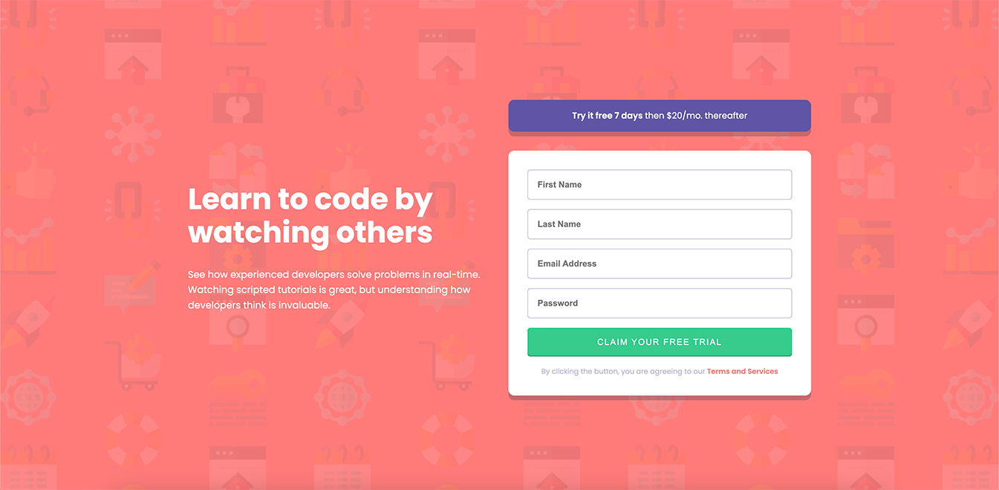

# Frontend Mentor - Intro component with sign up form solution

This is a solution to the [Intro component with sign up form challenge on Frontend Mentor](https://www.frontendmentor.io/challenges/intro-component-with-signup-form-5cf91bd49edda32581d28fd1). Frontend Mentor challenges help you improve your coding skills by building realistic projects.

## Table of contents

- [Overview](#overview)
  - [The challenge](#the-challenge)
  - [Screenshot](#screenshot)
  - [Links](#links)
- [My process](#my-process)
  - [Built with](#built-with)
  - [What I learned](#what-i-learned)
  - [Continued development](#continued-development)
  - [Useful resources](#useful-resources)
- [Author](#author)
- [Acknowledgments](#acknowledgments)

## Overview

### The challenge

Users should be able to:

- View the optimal layout for the site depending on their device's screen size
- See hover states for all interactive elements on the page
- Receive an error message when the `form` is submitted if:
  - Any `input` field is empty. The message for this error should say _"[Field Name] cannot be empty"_
  - The email address is not formatted correctly (i.e. a correct email address should have this structure: `name@host.tld`). The message for this error should say _"Looks like this is not an email"_

### Screenshot



### Links

- Solution URL: [Solution](https://github.com/Max88-git/intro-component)
- Live Site URL: [Live](https://max88-git.github.io/intro-component/)

## My process

### Built with

- Semantic HTML5 markup
- CSS custom properties
- Flexbox
- Vanilla JavaScript

### What I learnt

This project taught me about email validation. Also, when the form is submitted, how to add an error message to an input field.

Here are some code snippets I am proud of:

```js
// If the field is empty the .error class will be displayed
if (!input.value) {
  input.parentElement.classList.add("error");
} else {
  input.parentElement.classList.remove("error");
}
```

```js
// If the email is validated no error will be displayed
if (input.type == "email") {
  if (validateEmail(input.value)) {
    input.parentElement.classList.remove("error");
  } else {
    // Show error if email address is not formatted correctly
    input.parentElement.classList.add("error");
  }
}
```

### Useful resources

- [Client-side form validation](https://developer.mozilla.org/en-US/docs/Learn/Forms/Form_validation) - This helped me to understand what client-side form validation is and why it's important.

## Author

- Website - [Max Lockwood](https://www.maxlockwood.uk/)
- Frontend Mentor - [@Max88-git](https://www.frontendmentor.io/profile/Max88-git)
- Twitter - [@maxlockwood88](https://twitter.com/maxlockwood88)
